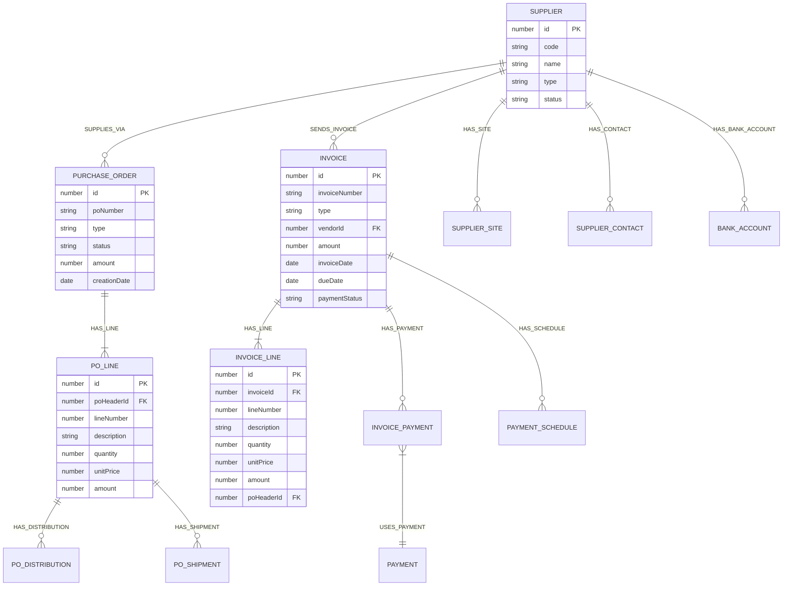
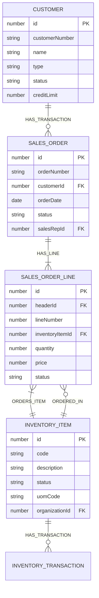
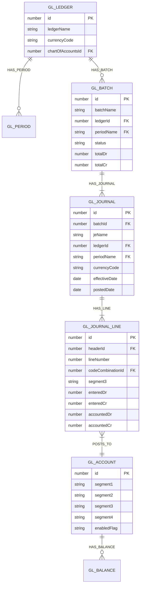
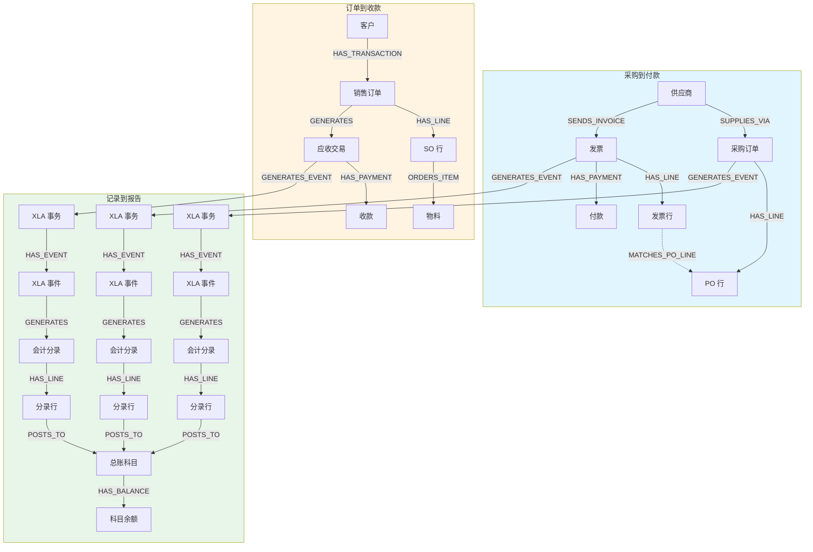

# Oracle EBS 完整表关系图 (ER Diagram)

## 供应商与采购模块

## 销售与库存模块

## 总账与会计模块

## 完整业务流程图 (P2P + O2C + R2R)

## 字段级关系详情

### ap_suppliers (供应商主表)

| 字段 | 类型 | 关联表 | 关联字段 | 关系类型 |
|------|------|--------|---------|---------|
| vendor_id | NUMBER | - | - | 主键 |
| segment1 | VARCHAR2 | - | - | 业务键 |
| created_by | NUMBER | per_all_people_f | employee_id | 外键 |
| invoice_currency_code | VARCHAR2 | fnd_currencies | currency_code | 外键 |

### po_headers_all (采购订单头表)

| 字段 | 类型 | 关联表 | 关联字段 | 关系类型 |
|------|------|--------|---------|---------|
| po_header_id | NUMBER | - | - | 主键 |
| segment1 | VARCHAR2 | - | - | 业务键 |
| vendor_id | NUMBER | ap_suppliers | vendor_id | 外键 |
| created_by | NUMBER | per_all_people_f | employee_id | 外键 |
| approved_by | NUMBER | per_all_people_f | employee_id | 外键 |

### ap_invoices_all (发票头表)

| 字段 | 类型 | 关联表 | 关联字段 | 关系类型 |
|------|------|--------|---------|---------|
| invoice_id | NUMBER | - | - | 主键 |
| invoice_num | VARCHAR2 | - | - | 业务键 |
| vendor_id | NUMBER | ap_suppliers | vendor_id | 外键 |
| created_by | NUMBER | per_all_people_f | employee_id | 外键 |

### ap_invoice_lines_all (发票行表)

| 字段 | 类型 | 关联表 | 关联字段 | 关系类型 |
|------|------|--------|---------|---------|
| invoice_line_id | NUMBER | - | - | 主键 |
| invoice_id | NUMBER | ap_invoices_all | invoice_id | 外键 |
| po_header_id | NUMBER | po_headers_all | po_header_id | 外键 (隐式) |
| po_line_id | NUMBER | po_lines_all | po_line_id | 外键 (隐式) |

---

**生成时间**: 2026-04-03  
**工具**: generate_relationship_map.py
